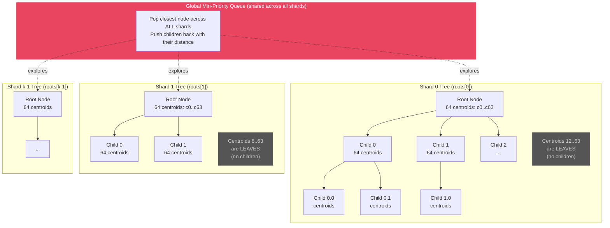
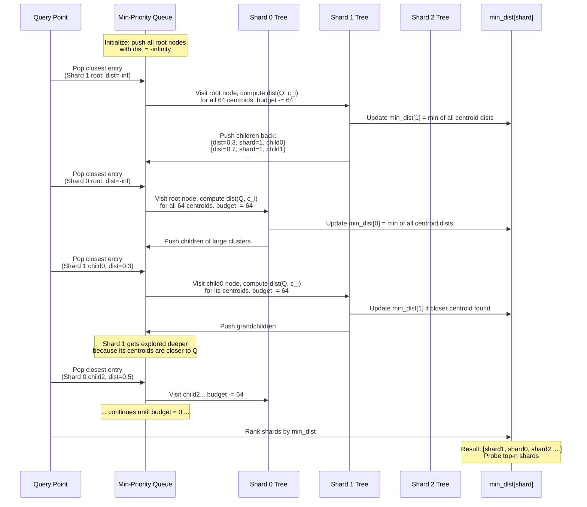
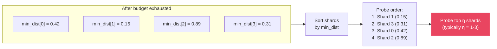

# KMeans Tree Router: Structure and Query Routing

## Tree Structure (one tree per shard)

Each shard gets its own hierarchical k-means tree built during `Train`.
Within each tree node, centroids are ordered so that centroids **with children come first**.
Centroid `i` has a child subtree only if `i < node.children.size()`.

## Query Routing: Best-First Interleaved Traversal

The key idea: all shard trees are explored **simultaneously** through a single
shared priority queue, ordered by distance to query. The budget limits total
distance computations across all shards.

## How shards get ranked

After the budget is exhausted, `min_dist[shard]` holds the closest centroid
distance seen for each shard. Shards are sorted by this value — the shard
whose tree had a centroid closest to the query gets probed first.

## Why the interleaving matters

The budget is **shared across all shards**. A shard whose root-level centroids
are far from the query won't get much exploration — its children sit deep in the
priority queue and the budget runs out before reaching them. A shard with a close
root centroid gets explored deeply (multiple levels), producing a tighter
`min_dist` estimate. This naturally allocates more computation to promising shards.

### Code references

| Step | Function | Location |
|------|----------|----------|
| Build per-shard trees | `KMeansTreeRouter::Train` | `src/kmeans_tree_router.cpp:9` |
| Recursive tree building | `KMeansTreeRouter::TrainRecursive` | `src/kmeans_tree_router.cpp:39` |
| Query routing (distance) | `KMeansTreeRouter::Query` | `src/kmeans_tree_router.cpp:111` |
| Query routing (frequency) | `KMeansTreeRouter::FrequencyQuery` | `src/kmeans_tree_router.cpp:151` |
| Tree node definition | `KMeansTreeRouter::TreeNode` | `src/kmeans_tree_router.h:57` |
| Router options | `KMeansTreeRouterOptions` | `src/kmeans_tree_router.h:6` |
