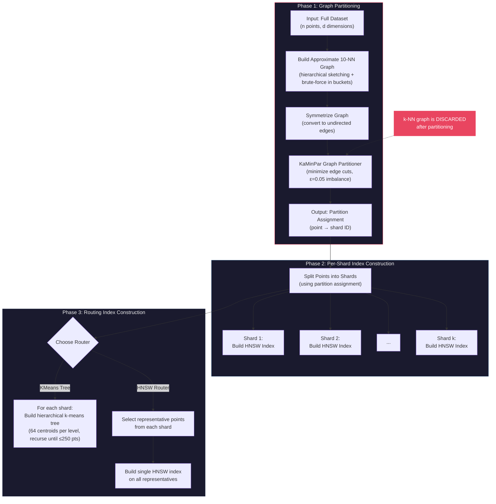
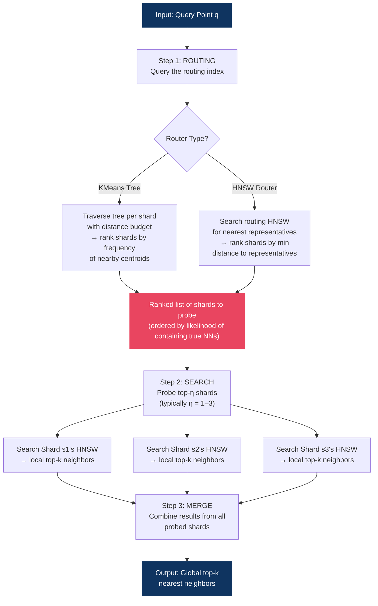

# GP-ANN: Graph Partitioning for Approximate Nearest Neighbor Search

**Paper:** "Unleashing Graph Partitioning for Large-Scale Nearest Neighbor Search"
**Authors:** Lars Gottesbüren, Laxman Dhulipala, Rajesh Jayaram, Jakub Lacki
**Link:** https://arxiv.org/abs/2403.01797

## Construction Pipeline

## Query Pipeline

## Two Graphs: Partitioning vs Search

The system uses two completely separate graph structures for different purposes:

| | k-NN Graph (partitioning) | HNSW Indexes (search) |
|---|---|---|
| **Purpose** | Input to KaMinPar to decide which points go to which shard | Search structure within each shard |
| **Scope** | Global — covers all n points | Local — one per shard |
| **Lifetime** | Built once, then **discarded** (points even dropped from memory) | Persisted for all queries |
| **Structure** | Simple adjacency list, ~10 neighbors/point | Hierarchical navigable small-world graph with multiple layers |
| **Built by** | `ApproximateKNNGraphBuilder` in `src/knn_graph.h` | `hnswlib::HierarchicalNSW` in `src/inverted_index_hnsw.h` |

The k-NN graph's only job is to tell KaMinPar "these points are neighbors, keep them together." Once the partition assignment is computed, it is thrown away and fresh HNSW indexes are built on each shard for actual search.

## Key Parameters

| Parameter | Typical Value | Description |
|---|---|---|
| `num_clusters` / `k` | 40–48 | Number of shards |
| `epsilon` | 0.05 | Max partition imbalance (5%) |
| `M` | 16–32 | HNSW max connections per layer |
| `ef_construction` | 200 | HNSW build-time quality |
| `ef_search` | 50–500 | HNSW query-time quality/speed tradeoff |
| `num_centroids` | 64 | KMeans tree centroids per level |
| `min_cluster_size` | 250 | KMeans tree leaf size |
| `budget` | 50,000 | KMeans tree routing distance computation budget |
| `num_voting_neighbors` | 20–500 | HNSW router candidates |
| `η` (num_probes) | 1–3 | Shards probed per query |
| `overlap` | 0–0.2 | Fraction of overlapping assignments (OGP) |

## Feasibility for 2000+ PIM DPUs

| Aspect | Paper's regime | 2000 DPU regime |
|---|---|---|
| Shard count | 40–48 | 2000+ |
| Points per shard | ~25M (1B/40) | ~500K (1B/2000) |
| Neighbor concentration | >96% in 1 shard | Likely much lower |
| Probes needed | 1–3 | Likely 10+ |
| Routing cost | Small vs search | May dominate |
| Memory per node | Server-scale (GBs) | ~64MB DPU MRAM |

**Challenges at 2000+ partitions:**
- Graph partitioning quality degrades — more edges cut across shards
- The "96% of neighbors in 1 shard" property erodes, requiring more probes per query
- Routing must efficiently narrow 2000 candidates (current routers tested at ~40)
- Per-shard HNSW indexes become very small (~500K points), shifting bottleneck to routing + communication
- UPMEM DPUs have ~64MB MRAM (vectors alone for 500K points in 100d float32 ≈ 200MB)
- UPMEM DPUs lack hardware floating-point — distance computation needs fixed-point arithmetic
